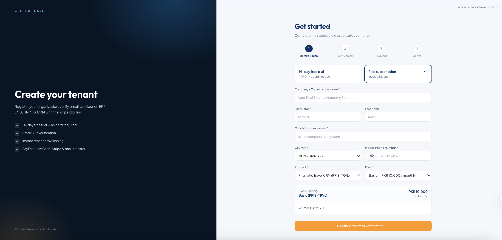
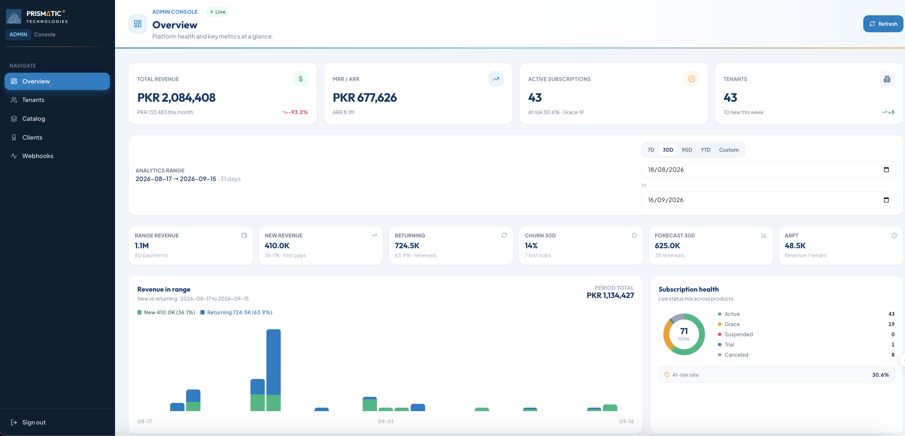
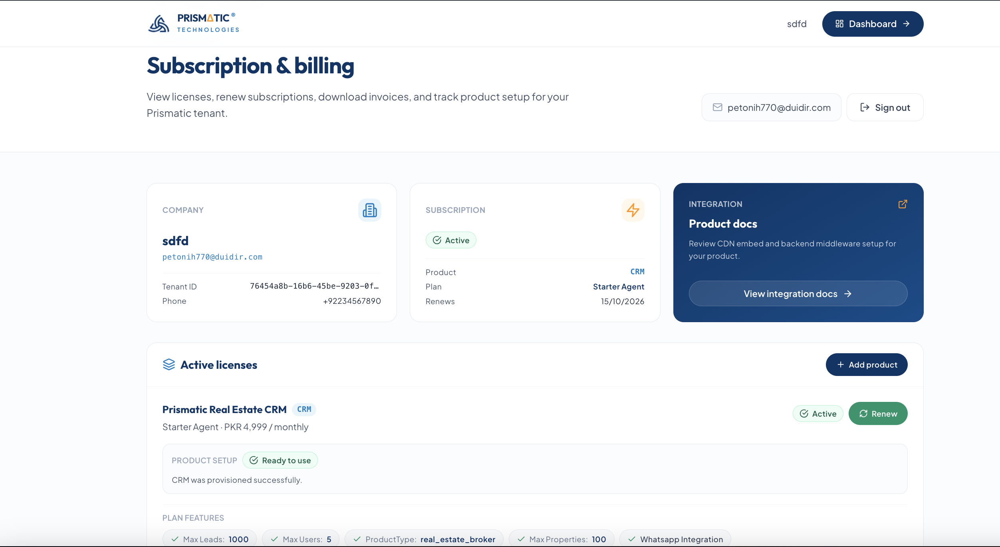
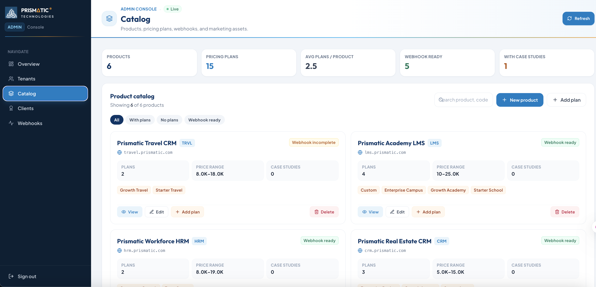
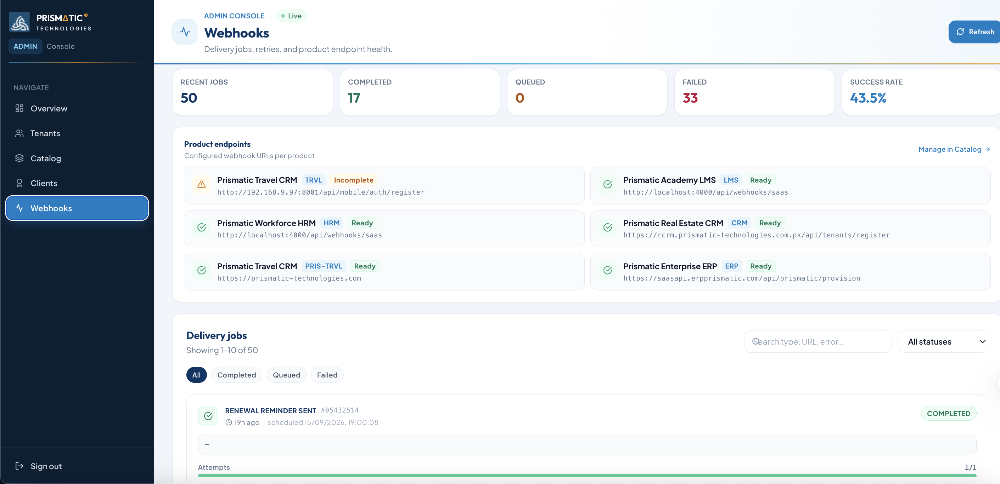

# Prismatic Central SaaS — Multi-Product Tenant & Billing Platform

> **Note:** This repository is a case study, not a source dump. It was built at Prismatic Technologies Limited as an internal platform product; the source is proprietary. This README documents the architecture, my role, and the engineering decisions behind it.

 

## Overview

Prismatic Central SaaS is a multi-product subscription and tenant-management platform for Prismatic Technologies. It acts as the central control plane for products like ERP, CRM, LMS, and HRM — companies register once, pick a plan (trial or paid), and get provisioned into the right product.

It handles tenant signup, email OTP verification, portal login, billing/renewals, and the full subscription lifecycle (active → grace → suspended). An admin console manages catalogs, tenants, webhooks, and billing overview. Product apps stay in sync through signed webhooks and JWT-based access checks.

## My Role

Built solo — design, frontend, backend API, database schema, payments, email flows, provisioning integrations, and deployment.

## Tech Stack

| Layer | Technologies |
|---|---|
| Frontend | Next.js 14, React 18, TypeScript, Tailwind CSS |
| Backend | Node.js, Express, TypeScript |
| Database | MySQL + Prisma ORM |
| Auth / Security | RS256 JWT, HMAC webhook signatures, hashed portal passwords |
| Jobs / Automation | node-cron, DB job queue for webhooks |
| Payments | PayFast (plus JazzCash / EasyPaisa / Stripe / bank transfer scaffolding) |
| Email | Nodemailer / SMTP |

## Architecture

```
┌────────────────────┐     Tenant signup / OTP      ┌───────────────────────┐
│   Tenant Portal      │ ───────────────────────────▶│                        │
│   (Next.js)          │◀────────────────────────────│   Central API (Node)   │
└────────────────────┘     Billing / renewals        │   + MySQL/Prisma       │
                                                       └──────────┬─────────────┘
                                                                  │ signed HMAC webhooks
                                                                  │ + JWT (RS256)
                                     ┌────────────────────────────┼────────────────────────────┐
                                     ▼                            ▼                            ▼
                              ┌───────────┐               ┌───────────┐                ┌───────────┐
                              │    ERP     │               │    CRM     │                │  LMS/HRM   │
                              │  Product   │               │  Product   │                │  Product   │
                              └───────────┘               └───────────┘                └───────────┘

              node-cron: renewal reminders (day 7/3/1) → grace period → suspension
```

## Standout Features

- **Resumable Tenant Onboarding** — multi-product registration with a resumable "pending signup" state after email verification, so users don't lose progress if they drop off mid-flow.
- **Subscription Lifecycle Engine** — automated renewal reminders at day 7/3/1, grace period handling, and suspension, all driven by scheduled jobs.
- **Product Provisioning Webhooks** — HMAC-signed webhooks with retry logic to provision tenants into CRM/ERP instances.
- **Per-Tenant Plan Overrides** — company-locked plans that override the shared catalog without duplicating it.
- **Tenant Self-Service Portal** — licenses, invoices, renewals, and recovery for incomplete signups.
- **Admin Dashboard** — products, plans, tenants, webhooks, and billing KPIs in one console.
- **Embed Billing Gate** — a lightweight `embed.js` script that product apps use to verify subscription status via CDN.

## Screenshots

<!-- Add images to a screenshots/ folder and reference them below -->

| Tenant Signup Flow | Admin Billing Dashboard | Subscription Lifecycle View |
|---|---|---|
|  |  |  |

| Tenant Portal (Invoices/Renewals) | Plan/Catalog Management | Webhook Management |
|---|---|---|
|  |  |  |

## What I'd Improve Next

- Move webhook delivery from a DB-polled job queue to a proper message queue (e.g. BullMQ/Redis) for lower latency at scale
- Add idempotency keys to payment callbacks to fully rule out double-processing on retries
